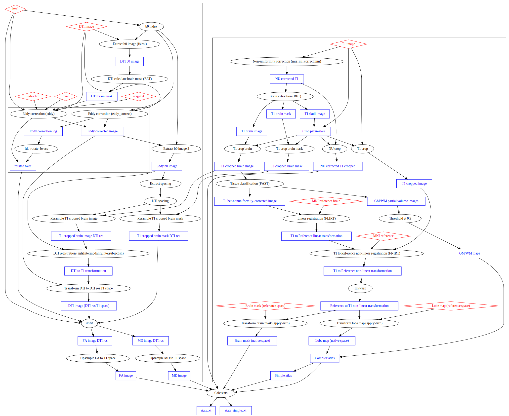

[](https://singularity-hub.org/collections/2586)

# Overview and Quickstart

This pipeline calculates average T1 intensity, FA, and MD for grey
matter and white matter and different lobes using FSL and
FreeSurfer. It also calculates a T1 normalization factor based on a
brain mask

This pipeline may be installed using either a singularity container
(prefered) or by installing the prerequisits manually. Using
the pipeline with singularity is outlined in [Workflow 1](#Workflow-1-prefered), and
using with the manual installation is outlined in [Workflow 2](#Workflow-2).

## Setup

The input data should be organized in a subjects folder, where each subject
has their own folder. For example:

```bash
/
├── project
│   └── charge
│       └── subjects
│           ├── sub1
│           │   ├── sub1_dti.bval
│           │   ├── sub1_dti.bvec
│           │   ├── sub1_dti.nii
│           │   └── sub1_t1w.nii
│           ├── sub2
│           │   ├── sub2_dti.bval
│           │   ├── sub2_dti.bvec
│           │   ├── sub2_dti.nii
│           │   └── sub2_t1w.nii
│           └── sub3
│               ├── sub3_dti.bval
│               ├── sub3_dti.bvec
│               ├── sub3_dti.nii
│               └── sub3_t1w.nii
```

Create an output folder alongside the subjects folder and change to that directory
```bash
mkdir /project/charge/Charge_GM_WM_Properties_Pipeline_out
cd /project/charge/Charge_GM_WM_Properties_Pipeline_out
```
Create a folder for log files
```bash
mkdir logs
```

NB. The subject name cannot contain spaces.

## Workflow 1 (prefered)

1. If singularity 2.5.2 or greater is not installed on your system then [install singularity](#Installing-Singularity)
2. Please ensure that you agree to the terms in the [FSL license](https://surfer.nmr.mgh.harvard.edu/fswiki/FreeSurferSoftwareLicense).
3. Download the singularity container
   ```bash
   singularity pull --name charge_container.simg shub://pndni/Charge_GM_WM_Properties_Pipeline:1.0.0-alpha8
   ```
   which gets saved to `charge_container.simg`
4. Clone this repository to acquire the helper files.
   ```bash
   git clone --branch 1.0.0-alpha8 https://github.com/pndni/Charge_GM_WM_Properties_Pipeline.git
   ```
5. Copy `run_subject_container.sh` to the working directory, 
   ```bash
   cp Charge_GM_WM_Properties_Pipeline/helper/run_subject_container.sh ./
   ```
   and edit it to match your directory structure. Using
   the structure above, it would be:

   ```bash
   #!/bin/bash
   
   set -e
   set -u
   
   subject="$1"
   
   indir=/project/charge/subjects/$subject
   outdir=/project/charge/Charge_GM_WM_Properties_Pipeline_out/$subject
   logdir=/project/charge/Charge_GM_WM_Properties_Pipeline_out/logs
   
   t1="$subject"_t1w.nii
   dti="$subject"_dti.nii
   bvec="$subject".bvec
   bval="$subject".bval

   if [[ "$outdir" =~ .*/.* ]]
      then
          outdirbase="${outdir%/*}"
          outdirlast="${outdir##*/}"
   else
          outdirbase="."
          outdirlast="$outdir"
   fi
   
   singularity run \
   --bind "$indir":/mnt/indir:ro \
   --bind "$outdirbase":/mnt/outdir \
   --app charge \
   --cleanenv \
   charge_container.simg -q -f /mnt/outdir/license.txt \
   /mnt/indir \
   "$t1" \
   /mnt/outdir/"$outdirlast" \
   "$dti" \
   "$bvec" \
   "$bval" \
   > "$logdir"/"$subject"_stdout.log \
   2> "$logdir"/"$subject"_stderr.log
   ```
   If your file names are less predictable (e.g. `${subject}_${date}_t1w.nii`),
   [findfile.sh](helper/findfile.sh) may be used to search for a file with
   a given suffix. First, copy it to the working directory
   ```bash
   cp Charge_GM_WM_Properties_Pipeline/helper/findfile.sh ./
   ```
   then edit `run_subject_container.sh` to use `findfile.sh` to search for a filename with a specific suffix. E.g.,
   ```bash
   t1=$(./findfile.sh $indir t1w.nii)
   ```
   will find a file ending with `t1w.nii` in `$indir`.
6. Create  a file named `subject_list` which contains a list of each subject, separated by newlines. For the directory
   structure above.
   ```bash
   sub1
   sub2
   sub3
   ```
   This may be created using a command such as
   ```bash
   ls /project/charge/subjects | grep -e '^sub' > subject_list
   ```
7. Copy the FreeSurfer license file to `/project/charge/Charge_GM_WM_Properties_Pipeline_out/license.txt`
   If you already have a freesurfer license, you can copy it with
   ```bash
   cp $FREESURFER_HOME/license.txt /project/charge/Charge_GM_WM_Properties_Pipeline_out/license.txt
   ```
8. If you are using a computing cluster, go to 8.ii, otherwise, go to 8.i
    1. Copy parallel.sh to the working directory
       ```bash
       cp Charge_GM_WM_Properties_Pipeline/helper/parallel.sh ./
       ```
       and modify it for your system (see the comments in the file).
       ```bash
       ntasks=3
       logfile=parallel.log
       parallel -j $ntasks --joblog $logfile ./run_subject_container.sh {} :::: subject_list
       ```
       Run the pipeline with
       ```bash
       ./parallel.sh
       ```
    2. If you are using a queuing system, you will need to set up a batch file specific to your system. An example
       file for systems using Slurm is provided. Copy this file to your working directory
       ```bash
       cp Charge_GM_WM_Properties_Pipeline/helper/slurm.sh ./
       ```
       and modify it for your system. (See the comments in the file).
       If using slurm, run the pipeline with
       ```bash
       sbatch slurm.sh
       ```

## Workflow 2

1. Install [FSL](https://fsl.fmrib.ox.ac.uk/fsl/fslwiki/FslInstallation)
2. Install [FreeSurfer](http://www.freesurfer.net/fswiki/DownloadAndInstall)
3. Clone this repository.
   ```bash
   git clone --branch 1.0.0-alpha8 https://github.com/pndni/Charge_GM_WM_Properties_Pipeline.git
   ```
4. Set `CHARGEDIR` environment variable
   to the location of the repository (using a full path).
   ```bash
   export CHARGEDIR=$PWD/Charge_GM_WM_Properties_Pipeline
   ```
5. Copy `run_subject.sh` to the working directory, 
   ```bash
   cp Charge_GM_WM_Properties_Pipeline/helper/run_subject.sh ./
   ```
   and edit it to match your directory structure. Using
   the structure above, it would be:

   ```bash
   #!/bin/bash
   
   set -e
   
   ## TODO
   # if necessary, setup FSL and freesurfer here
   # for example:
   # FREESURFER_HOME="TODO path to freesurfer"
   # source $FREESURFER_HOME/SetUpFreeSurfer.sh
   # FSLDIR="TODO path to fsl"
   # source $FSLDIR/etc/fslconf/fsl.sh
   # export PATH=${FSLDIR}/bin:$PATH
   
   set -u
   
   subject="$1"
   
   indir=/project/charge/subjects/$subject
   outdir=/project/charge/Charge_GM_WM_Properties_Pipeline_out/$subject
   logdir=/project/charge/Charge_GM_WM_Properties_Pipeline_out/logs
   
   t1="$subject"_t1w.nii
   dti="$subject"_dti.nii
   bvec="$subject".bvec
   bval="$subject".bval
   
   "$CHARGEDIR"/scripts/pipeline.sh -q "$indir" "$t1" "$outdir" "$dti" "$bvec" "$bval" \
   > "$logdir"/"$subject"_stdout.log \
   2> "$logdir"/"$subject"_stderr.log
   ```
   If your file names are less predictable (e.g. `${subject}_${date}_t1w.nii`),
   [findfile.sh](helper/findfile.sh) may be used to search for a file with
   a given suffix. First, copy it to the working directory
   ```bash
   cp Charge_GM_WM_Properties_Pipeline/helper/findfile.sh ./
   ```
   then edit `run_subject.sh` to use `findfile.sh` to search for a filename with a specific suffix. E.g.,
   ```bash
   t1=$(./findfile.sh $indir t1w.nii)
   ```
   will find a file ending with `t1w.nii` in `$indir`.
6. Create  a file named `subject_list` which contains a list of each subject, separated by newlines. For the directory
   structure above.
   ```bash
   sub1
   sub2
   sub3
   ```
   This may be created using a command such as
   ```bash
   ls /project/charge/subjects | grep -e '^sub' > subject_list
   ```
7. If you are using a computing cluster, go to 7.ii, otherwise, go to 7.i
    1. Copy parallel.sh to the working directory
       ```bash
       cp Charge_GM_WM_Properties_Pipeline/helper/parallel.sh ./
       ```
       and modify it for your system (see the comments in the file).
       ```bash
       ntasks=3
       logfile=parallel.log
       parallel -j $ntasks --joblog $logfile ./run_subject.sh {} :::: subject_list
       ```
       Run the pipeline with
       ```bash
       ./parallel.sh
       ```
    2. If you are using a queuing system, you will need to set up a batch file specific to your system. An example
       file for systems using Slurm is provided. Copy this file to your working directory
       ```bash
       cp Charge_GM_WM_Properties_Pipeline/helper/slurm.sh ./
       ```
       and modify it for your system. (See the comments in the file).
       If using slurm, run the pipeline with
       ```bash
       sbatch slurm.sh
       ```
       
# Installing Singularity

If singularity is not pre-installed on your system, it may be installed following [these instructions](https://www.sylabs.io/guides/2.5/user-guide/quick_start.html#quick-installation-steps)
with the version modified:
```bash
git clone https://github.com/sylabs/singularity.git

cd singularity

git fetch --all

git checkout 2.5.2

./autogen.sh

./configure --prefix=/usr/local

make

sudo make install
```

# Advanced Usage

The pipe script or singularity container may be called directly for a given subject. Using singularity
```bash
singularity run --containall --app charge --bind "input_directory":/mnt/input:ro --bind "output_directory":/mnt/output -q -f "freesurfer_license" /mnt/indir "t1_filename" /mnt/outdir "dti_filename" "bvec_filename" "bval_filename"
```
where the full path of the t1 file is `"input_directory"/"t1_filename"`, etc.
The `-q` flag turns on QC pages, and the `-f` option specifies the full path of the
FreeSurfer license (which must be visible from the running container). This option is required when using
the singularity container.
A FreeSurfer license can be obtained [here](https://surfer.nmr.mgh.harvard.edu/registration.html).

NB. We recommended _not_ having spaces in the filenames or paths

The equivalent command without singularity is
```bash
$CHARGEDIR/scripts/pipeline.sh -q "input_directory" "t1_filename" "output_directory" "dti_filename" "bvec_filename" "bval_filename"
```

## input arguments

| Argument | Description                                                                                                                               |
|----------|-------------------------------------------------------------------------------------------------------------------------------------------|
| -q       | Output QC page for subject                                                                                                                |
| -f       | FreeSurfer license file. Must be a full path. If using singularity this option is required, and must be visible from inside the container |
| indir    | Input directory containing T1 image, DTI data, bvec, and bval                                                                             |
| t1       | Base file name of the T1 scan in nifty format. The full path is therefore $indir/$t1.                                                     |
| outdir   | Output directory name. Must not exist.                                                                                                    |
| dti      | DTI data in nifty format                                                                                                                  |
| bvec     | bvec file                                                                                                                                 |
| bval     | bval file                                                                                                                                 |

## Helper scripts

There are two scripts provided which may be modified to simplify
running the pipeline:
[run_subject_container.sh](helper/run_subject_container.sh) for use
with singularity and [run_subject.sh](helper/run_subject.sh) for the
manual installation. These must be modified for your site. See the
comments in the file for instructions. Once modified, a subject may be
run by calling `./run_subject_container.sh subject1`, for example.

## Batch processing

### GNU-parallel

An example [file](helper/parallel.sh) is provided for batch processing
using gnu-parallel. See the comments for details.

### SLURM

An example [file](helper/slurm.sh) is provided for batch processing on
a compute cluster using Slurm. The example provided is for Compute
Canada's Niagara cluster. See comments in the file for how to adapt to
your site.

# Outputs

## Stats files

The final outputs are `stats.txt` and `stats_simple.txt` for each
subject. Each of these is in the `stats_out` subdirectory of each
subject's output folder. `stats_simple.txt` contains statistics (e.g.,
mean, standard deviation) for T1 intensity, FA, and MD images for grey
matter, white matter, and the brain mask. Grey matter and white matter
calculations are limited to the frontal, parietal, temporal, and
occipital lobes. For example

```
# Data calculated using pipeline.sh with sha256 has dabdbd33522f7789e9dc274afc0a7b9bacc8c02b890a396b32dc171dd0d5aaf0  /scif/apps/charge/scripts/pipeline.sh
# Version: 1.0.0
# Input directory: /mnt/indir
# T1 filename: sub1_t1w.nii
# DTI filename: sub1_dti.nii
# bvec: sub1_dti.bvec
# bval: sub1_dti.bval
# Onput directory: /mnt/outdir/sub1
# Thu Apr  4 11:26:26 EDT 2019
    gm  wm  Brain
T1_mean 132.543153  192.408432  147.460649
T1_median   132.0   194.0   148.0
T1_std  18.277784   14.349024   43.706443
T1_min  83.000000   146.000000  0.000000
T1_max  184.000000  248.000000  255.000000
T1_nvoxels  1904390 1539466 4831888
T1_volume   476097.500000   384866.500000   1207972.000000
T1_skew 0.08830975868781726 -0.20740648242728188    -0.4995048250367561
T1_kurtosis -0.8085754376168155 -0.47384199662105786    -0.1787508983708661
FA_mean 0.160421    0.337839    0.232258
FA_median   0.1363086923956871  0.32776249945163727 0.1890806183218956
FA_std  0.092652    0.153809    0.149830
FA_min  0.016808    0.016798    0.012751
FA_max  1.172887    1.028570    1.172887
FA_nvoxels  1904390 1539466 4831888
FA_volume   476097.500000   384866.500000   1207972.000000
FA_skew 1.8720239661108977  0.512975937641004   1.1702564747724462
FA_kurtosis 5.55129321688476    0.12349222847906116 1.1426128357323
MD_mean 0.000944    0.000782    0.000909
MD_median   0.0008798134222161025   0.0007501131622120738   0.0008163018792401999
MD_std  0.000265    0.000148    0.000307
MD_min  -0.000988   -0.000458   -0.001003
MD_max  0.003560    0.003184    0.003745
MD_nvoxels  1904390 1539466 4831888
MD_volume   476097.500000   384866.500000   1207972.000000
MD_skew 1.5909165225398094  2.966903477171533   2.159555195688378
MD_kurtosis 4.7861540352992975  15.551729763640417  7.230834464420985
```

`stats.txt` is similar, but contains results for each part of the lobe
mask separately (i.e. the complex atlas described below).

## errorflag, warningflag, and status.txt

### warningflag
    The `fnirt` stdout is searched for a specific warning regarding the invertibility of the registration.
    If the warning is found, the contents of the `warningflag` file is set to 1, otherwise it is set to 0.
    If the warning is found and any of the reported Jacobian determinants are < -0.5, the `errorflag` is also set (see below).
    See [here](https://www.jiscmail.ac.uk/cgi-bin/webadmin?A2=fsl;f2771bce.1511) for more details.

### errorflag
    The stderr outputs for many of the commands are checked for errors. If anything suspicious is found,
    the contents of the `errorflag` file is set to 1, otherwise it is set to 0. `errorflag` is also set to 1
    if `fnirt` stdout reports results.
    
### status.txt
    `status.txt` is a more human-readable report of the errors/warnings

## QC pages

If the `-q` flag is used, a QC page is generated for each subject.
This is located at `QC/index.html` in the subject's output directory.

QC pages should be used to verify that the pipeline ran successfully for each subject.
Some things to look out for:

1. Ensure that the skull is not cropped in the initial cropping steps
2. Check the registration outputs
3. Check for warnings or errors in the log files on the QC page

# Combining data from all the subjects

Assuming your output directories are in a common
 directory and these directories have the same names as the subjects,
 e.g.:
```
├── project
│   └── charge
│       └── Charge_GM_WM_Properties_Pipeline_out
│           ├── sub1
│           ├── sub2
│           └── sub3
```
Then the script `combine_data.sh` may be used to create a tsv file
where each row corresponds to one subject. Assuming you're still in the
output directory, copy the `combine_data.sh` script
```bash
cp Charge_GM_WM_Properties_Pipeline/scripts/combine_data.sh ./
```
To combine the `stats.txt`
files, run
```bash
./combine_data.sh stats < subject_list > stats_combined.txt
```
and to combine the `stats_simple` files, run
```bash
./combine_data.sh stats_simple < subject_list > stats_simple_combined.txt
```


# Pipeline description

The main steps in this pipeline are
1. Calculate tissue and lobe map for the current subject
2. Process T1 data
3. Process DTI data
4. Apply tissue and lobe map to processed T1 and DTI data

## Calculate tissue and lobe map

The tissue type (CSF, grey matter, or white matter) is calculated
using FSL tools and the T1 image in the following steps.

1. Extract brain (BET) and crop image to reduce image size
2. Classify tissues using FAST (voxels are considered WM or GM if FAST estimates that voxel as being 90% that tissue. i.e., the partial volume
outputs are thresholded at 0.9)

A lobe map and brain mask are provided with the pipeline. These are in
MNI reference space, and need to be transformed to native (T1) space
for each subject. This is done with:
1. Linear registration (FLIRT) of non-uniformity corrected brain image (BET output) with MNI brain image
2. Non-linear registration (FNIRT) of T1 image with MNI image
3. Apply non-linear transformation to T1 brain image for QC
4. Invert the non-linear transformation
5. Apply inverse transformation to lobe map and brain mask

The lobe map and tissue masks are then combined to create two atlases. The simple atlas contains two labels:

1. Grey matter in the frontal, parietal, temporal, and occipital lobes
2. White matter in the frontal, parietal, temporal, and occipital lobes

The complex atlas contains 28 labels

| Index | Region                | Hemisphere  | Tissue |
|-------|-----------------------|-------------|--------|
|  1.   | Frontal lobe          | right       | grey   |
|  2.   | Parietal lobe         | right       | grey   |
|  3.   | Temporal lobe         | right       | grey   |
|  4.   | Occipital lobe        | right       | grey   |
|  5.   | Frontal lobe          | left        | grey   |
|  6.   | Parietal lobe         | left        | grey   |
|  7.   | Temporal lobe         | left        | grey   |
|  8.   | Occipital lobe        | left        | grey   |
|  9.   | Cerebellum            | left        | grey   |
| 10.   | Sub-cortex            | left        | grey   |
| 11.   | Brainstem             | left        | grey   |
| 12.   | Cerebellum            | right       | grey   |
| 13.   | Sub-cortex            | right       | grey   |
| 14.   | Brainstem             | right       | grey   |
| 15.   | Frontal lobe          | right       | white  |
| 16.   | Parietal lobe         | right       | white  |
| 17.   | Temporal lobe         | right       | white  |
| 18.   | Occipital lobe        | right       | white  |
| 19.   | Frontal lobe          | left        | white  |
| 20.   | Parietal lobe         | left        | white  |
| 21.   | Temporal lobe         | left        | white  |
| 22.   | Occipital lobe        | left        | white  |
| 23.   | Cerebellum            | left        | white  |
| 24.   | Sub-cortex            | left        | white  |
| 25.   | Brainstem             | left        | white  |
| 26.   | Cerebellum            | right       | white  |
| 27.   | Sub-cortex            | right       | white  |
| 28.   | Brainstem             | right       | white  |


## Process T1 data

The T1 data is non-uniformity corrected using the N3 algorithm included with FreeSurfer
and then cropped using the parameters found previously.

## Process DTI data

The DTI processing is based on the begining of the [PSMD](http://www.psmd-marker.com/index.html) pipeline

DTI data is processed using FSL in the following steps
1. Search bval file to find the index of the structural scan in the DTI data set (i.e., where bval = 0)
2. Correct for eddy currents using FSL's eddy_correct, which linearly registers each image to the stuctural scan
3. Run brain extraction on the eddy corrected image
4. Run DTIFIT to calculate FA and MD
5. Linearly register the DTI structural image to T1 space
6. Transform FA and MD images to T1 space

## Calculate statistics

Finally, multiple statistics are calculated for each processed image
in each of the regions defined by both atlases. Additionally, the same
statistics are calculated using the brain mask (primarily for
normalizing the T1 intensity values).

## Flowchart



# References
| Algorithm/software | Citation |
|--------------------|----------|
| N3 algorithm | J. G. Sled, A. P. Zijdenbos, and A. C. Evans, ``A non-parametric method for automatic correction of intensity non-uniformity in MRI data, IEEE Transactions on Medical Imaging, vol. 17, pp. 87-97, February 1998. |
| parallel     | O. Tange (2011): GNU Parallel - The Command-Line Power Tool, ;login: The USENIX Magazine, February 2011:42-47. |
| FSL (ref 1)    | M.W. Woolrich, S. Jbabdi, B. Patenaude, M. Chappell, S. Makni, T. Behrens, C. Beckmann, M. Jenkinson, S.M. Smith. Bayesian analysis of neuroimaging data in FSL. NeuroImage, 45:S173-86, 2009 |
| FSL (ref 2)  | S.M. Smith, M. Jenkinson, M.W. Woolrich, C.F. Beckmann, T.E.J. Behrens, H. Johansen-Berg, P.R. Bannister, M. De Luca, I. Drobnjak, D.E. Flitney, R. Niazy, J. Saunders, J. Vickers, Y. Zhang, N. De Stefano, J.M. Brady, and P.M. Matthews. Advances in functional and structural MR image analysis and implementation as FSL. NeuroImage, 23(S1):208-19, 2004 |
| FSL (ref 3)  | M. Jenkinson, C.F. Beckmann, T.E. Behrens, M.W. Woolrich, S.M. Smith. FSL. NeuroImage, 62:782-90, 2012 |
| BET          | S.M. Smith. Fast robust automated brain extraction. Human Brain Mapping, 17(3):143-155, November 2002. |
| BET (skull)  | M. Jenkinson, M. Pechaud, and S. Smith. BET2: MR-based estimation of brain, skull and scalp surfaces. In Eleventh Annual Meeting of the Organization for Human Brain Mapping, 2005. |
| FAST         | Zhang, Y. and Brady, M. and Smith, S. Segmentation of brain MR images through a hidden Markov random field model and the expectation-maximization algorithm. IEEE Trans Med Imag, 20(1):45-57, 2001. |
| FLIRT (ref 1) | M. Jenkinson and S.M. Smith. A global optimisation method for robust affine registration of brain images. Medical Image Analysis, 5(2):143-156, 2001.  |
| FLIRT (ref 2) | M. Jenkinson, P.R. Bannister, J.M. Brady, and S.M. Smith. Improved optimisation for the robust and accurate linear registration and motion correction of brain images. NeuroImage, 17(2):825-841, 2002. | 
| FNIRT | Andersson JLR, Jenkinson M, Smith S (2010) Non-linear registration, aka spatial normalisation. FMRIB technical report TR07JA2 |
| FreeSurfer | http://surfer.nmr.mgh.harvard.edu/ (no overall paper) |
| PSMD | E. Baykara et al., “A Novel Imaging Marker for Small Vessel Disease Based on Skeletonization of White Matter Tracts and Diffusion Histograms,” Annals of Neurology, vol. 80, no. 4, pp. 581–592, 2016. |
